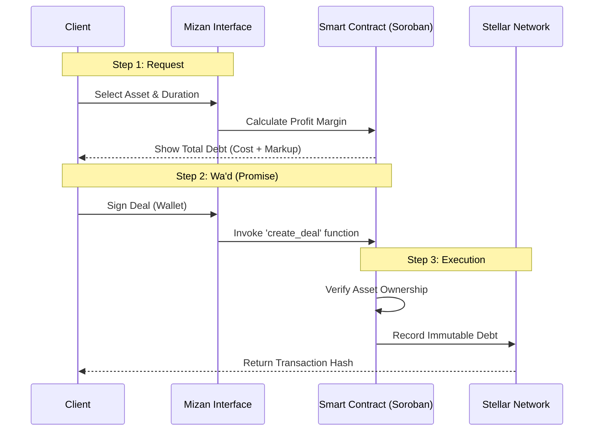

# Murabaha Workflow



```mermaid
sequenceDiagram
    participant Client
    participant Frontend as Mizan Interface
    participant Contract as Smart Contract (Soroban)
    participant Ledger as Stellar Network

    Note over Client, Frontend: Step 1: Request
    Client->>Frontend: Select Asset & Duration
    Frontend->>Contract: Calculate Profit Margin
    Contract-->>Client: Show Total Debt (Cost + Markup)

    Note over Client, Contract: Step 2: Wa'd (Promise)
    Client->>Frontend: Sign Deal (Wallet)
    Frontend->>Contract: Invoke 'create_deal' function
    
    Note over Contract, Ledger: Step 3: Execution
    Contract->>Contract: Verify Asset Ownership
    Contract->>Ledger: Record Immutable Debt
    Ledger-->>Client: Return Transaction Hash
```

